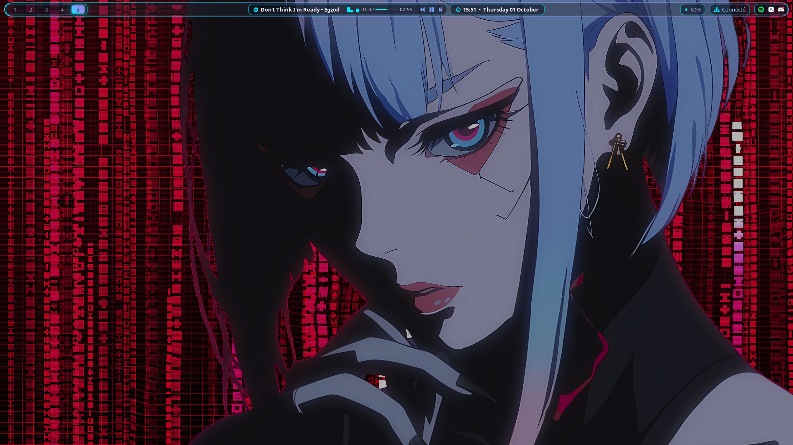
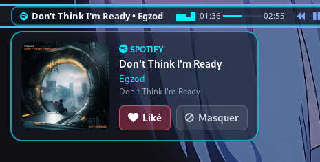
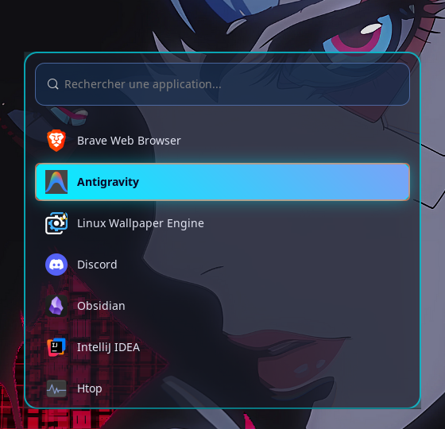
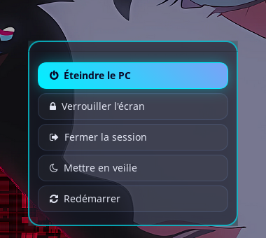

# Aurora — Hyprland Desktop Environment & Dotfiles 🌌

Configuration complète, moderne et haute performance pour **Hyprland** sous Linux / Wayland, propulsée par le thème **Aurora**.

- **Style Visuel** : Esthétique néon *glassmorphism* combinant des surfaces en verre fumé translucide (`rgba(10, 15, 30, 0.50)` / `0.20`), des bordures en dégradé vectoriel continu 45°/135° (`#00f0ff` ➔ `#7aa2f7` ➔ `#9778d0`) animées par rotation 360° matérielle sous GPU, et une courbure géométrique stricte à `17px` sur tous les conteneurs.
- **Fonctionnement & Architecture** : Écosystème Wayland hautement réactif articulé autour d'une architecture événementielle zéro-polling (signaux D-Bus MPRIS, sockets IPC Hyprland). Il intègre une barre d'état Waybar dynamique avec mini-lecteur Spotify synchrone, un lanceur d'applications Wofi translucide patché souris/clavier, un moteur de fond d'écran animé Wallpaper Engine multimoniteur avec démon IPC de reconnexion à chaud (hotplug), un auto-compactage déterministe des workspaces multi-écrans, un protocole de verrouillage sécurisé avec masquage atomique des surfaces et une passerelle MCP native pour l'automatisation IA.

<p align="center">
  
</p>

---

## 🎨 Identité Visuelle & Thème (Aurora)

<p align="center">
  
</p>

Le thème **Aurora** est un environnement visuel et ergonomique sur-mesure :

- **Palette de couleurs principale** :
  - Cyan électrique lumineux (primaire) : `#00f0ff`
  - Bleu Tokyo Night (secondaire) : `#7aa2f7`
  - Violet néon (accent) : `#9778d0`
  - Fond verre translucide : `rgba(10, 15, 30, 0.20)` (hyprbar) / `rgba(10, 15, 30, 0.50)` (cartes, modules, popups et Wofi)
- **Géométrie & Harmonie** :
  - Rayon d'angle arrondi : **`17px`** obligatoire sur tous les conteneurs (fenêtres Hyprland, Hyprbar, Wofi et la carte Spotify).
  - Épaisseur de bordure : **`2px`** uniforme sur tout l'environnement.
  - Dégradé vectoriel continu à 45° / 135° (`#00f0ff` ➔ `#7aa2f7` ➔ `#9778d0`) avec rotation continue matérielle GPU 360° sous Hyprland.

---

## ⚡ Déploiement & Installation Rapide

Un script d'installation automatisé et idempotent est disponible à la racine du dépôt pour déployer l'intégralité de l'environnement en une seule commande :

```bash
# 1. Cloner le dépôt
git clone https://github.com/BSourichanh/Hyprland_Aurora.git
cd Hyprland_Aurora

# 2. Lancer le déploiement complet
./setup.sh
```

### Ce que fait automatiquement `./setup.sh` :
1. **Dépendances système** : Détecte votre gestionnaire de paquets (`apt`, `pacman`) et installe les composants Wayland, polices, polkit et bibliothèques Python requises (saut possible via `./setup.sh --no-deps`).
2. **Sauvegarde préventive** : Archive automatiquement vos configurations existantes dans `~/.config/aurora_backup_<date>/`.
3. **Hard Links stricts** : Établit les 33 hard links physiques (mêmes inodes) entre `dotfiles/` et `~/.config/` garantissant la synchronisation bidirectionnelle immédiate.
4. **Permissions & Exécutables** : Règle les permissions `chmod +x` sur tous les scripts et installe l'utilitaire de gestion `hyprbar` dans `~/.local/bin/hyprbar`.
5. **Shaders Steam Workshop** : Synchronise automatiquement les shaders et textures de Lucy si le dossier Wallpaper Engine est détecté.
6. **Audit d'intégrité** : Valide la conformité complète des liaisons via `./scripts/wallpaper_tool.py check-links`.

---

## 🚀 Fonctionnalités Clés

### 1. Hyprbar (Waybar personnalisée)

<p align="center">
  
</p>

- **Fond translucide dépoli** : Utilisation d'un calque SVG vectoriel (`bar-bg.svg`) à 20% d'opacité combiné au flou de composition Hyprland, préservant la netteté des arrondis et le dégradé continu de 2px sans saignement opaque.
- **Bulles de modules dégradées** : Espaces de travail, horloge, contrôleur audio, statut réseau et zone de notification partagent le même encadrement néon glassmorphism.
- **Mini-lecteur Spotify unifié & Barre de progression avec égaliseur** :
  - **Fusion modulaire (`spacing: 0`)** : Regroupement continu des 5 sous-composants (`#mpris`, `#custom-spotify-progress`, commandes `prev`, `play-pause`, `next`).
  - **Égaliseur audio animé fin à largeur constante** : Barres vectorielles Unicode fines (`Noto Sans Mono 9pt`) insérées directement avant le timer écoulé (` ▃▅   01:23 ━━━ 03:45`), garantissant une largeur rigoureusement fixe (28px) sans aucun sautillement horizontal lors de l'animation (4 FPS en lecture cyan `#00f0ff`, figé en pause `#7aa2f7`).
  - **Barre de progression dynamique** : Affichage temps réel de la jauge vectorielle textuelle `───●────` et de l'horodatage (`MM:SS / MM:SS`) via streaming D-Bus natif (`spotify.py --progress`).
  - **Harmonisation chromatique 180°** : Dégradé vertical partagé (`linear-gradient(180deg, #9778d0 0%, #7aa2f7 50%, #00f0ff 100%)`) assurant une ligne haute violette et une ligne basse cyan rigoureusement continues, sans discontinuité diagonale.
  - **Repli total 0px (Anti-capsule fantôme)** : Conteneur parent à zéro bordure (`#spotify-player`). À l'arrêt de la lecture ou au démarrage de session, les modules s'effondrent à 0px sans laisser d'artefact visuel résiduel.
- **Architecture Événementielle Zéro-Polling (`signal: 11`)** :
  - Élimination stricte des forks répétitifs de sous-processus Python (`custom/spotify-prev`, `custom/spotify-play-pause`, `custom/spotify-next`).
  - Configuration de `signal: 11` avec `interval: 30` (filet de sécurité passif) dans `config.jsonc`.
  - Rafraîchissement instantané via signal POSIX temps réel `pkill -RTMIN+11 waybar` lors des clics et sur réception du signal D-Bus `PlaybackStatus`.
- **Helper MPRIS modulaire (`spotify.py`)** :
  - **Command Pattern & Dispatcher** : Séparation stricte des commandes (`--prev`, `--next`, `--play-pause`, `--progress`).
  - **Facade D-Bus** : Requêtes directes avec fail-safe timeouts (80 ms) et streaming d'égaliseur sans surconsommation CPU.

### 2. Carte Déroulante Spotify (`spotify-card.py`)

<p align="center">
  
</p>

- **Affichage au survol ou au clic** : Déroule instantanément une carte glassmorphism sous le mini-lecteur Waybar.
- **Architecture logicielle & Design Patterns** :
  - **Repository Pattern (`TrackRepository`)** : Gestion thread-safe (`threading.Lock`) et persistance atomique (`tempfile` + `os.replace`) des titres likés et masqués, éliminant tout risque de corruption de données.
  - **Facade Pattern (`MPRISPlayerFacade`)** : Appels D-Bus natifs pour `Next()`, `Previous()`, `PlayPause()`. Suppression totale des sous-processus `playerctl` et `xdotool` (< 1 ms de temps de réponse).
  - **Service & Singleton (`HyprlandIPCService`)** : Abstraction de la communication socket UNIX Hyprland pour le repositionnement ultra-rapide.
  - **Command Pattern (`IPCCommandHandler`)** : Routage découplé des ordres reçus sur le socket UNIX (`show`, `hide`, `toggle`, `like`, `masquer`).
  - **Observer Pattern (`MPRISObserver`)** : Écoute événementielle du signal `PropertiesChanged` sans aucune boucle active.
  - **Data Transfer Object (`TrackMetadata`)** : Typage immuable des métadonnées de piste.
- **Contrôles interactifs** :
  - ** Liker** : Ajoute la chanson aux favoris et mémorise l'état avec synchronisation SSE Spicetify.
  - ** Masquer** : Passe immédiatement à la piste suivante et met le morceau sur liste noire.

### 3. Lanceur d'Applications Wofi (`wofi-toggle.sh` & `style.css`)

<p align="center">
  
</p>

- **Comportement Hybride & Single-Click** :
  - Option `single_click=true` configurée dans `dotfiles/wofi/config` pour un lancement immédiat au premier clic souris.
  - Patch natif GTK3 ([`wofi-hover-select.patch`](dotfiles/wofi/wofi-hover-select.patch)) : synchronise dynamiquement la sélection active (`#entry:selected`) au survol du curseur de la souris sans jamais voler le focus clavier de la barre de recherche (`#input`).
  - Correction géométrique GTK3 : écoute exclusive sur `inner_box` avec coordonnées locales directes, évitant tout décalage d'index lié à la hauteur du champ de recherche.
- **Détection de clic extérieur événementielle** : Utilisation de `wait -n` au niveau du noyau Linux (0% de CPU pendant l'ouverture).
- **Style assorti** : Bordure en dégradé continu 135deg avec coins arrondis à 17px et ombre portée cyan néon.

### 4. Écran de Verrouillage Sécurisé (`lock.sh` & `hyprlock.conf`)
- **Masquage Dynamique & Protection Hotplug v2** : Démon d'écoute IPC d'arrière-plan sur `.socket2.sock` prenant en charge la spécification Hyprland (`monitoraddedv2` / `monitorremovedv2`). Bascule instantanée vers les espaces vides réservés (`98` sur DP-2, `99` sur DP-1).
- **Isolation Totale de Waybar** : Arrêt complet de Waybar pendant le verrouillage pour éliminer les réapparitions intempestives lors du hotplug d'écrans, et relance propre à la saisie du mot de passe.
- **Confidentialité des Notifications (SwayNC)** : Activation automatique du mode Ne Pas Déranger (`swaync-client -dn`) et fermeture forcée du volet pour supprimer toute bulle de notification sur l'écran de verrouillage. Restauration de l'état DND au déverrouillage.
- **Neutralisation de l'Auto-Compacteur** : Drapeau atomique `/tmp/hypr_locked` empêchant `workspace-autocompact.py` de déplacer des workspaces pendant le verrouillage.
- **Horloge Anti-Freeze Résiliente DPMS** : Remplacement de la variable passive `$TIME` (sujette aux race conditions internes lors des coupures d'écran) par un timer système explicite asservi au noyau Linux (`text = cmd[update:1000] date +"%H:%M"`), garantissant une heure exacte même après de longues sorties de veille.
- **Pattern RAII / Restauration Dynamique** : Restauration des workspaces d'origine encapsulée dans une routine `cleanup()` exécutée sur tous les signaux (`EXIT`, `INT`, `TERM`), ciblant uniquement les écrans réellement allumés.

### 5. Menu de Session & Alimentation Épuré (`power-menu.sh` & `power-menu.css`)

<p align="center">
  
</p>

- **Modale compacte sans recherche** : Accessible via <kbd>SUPER</kbd> + <kbd>S</kbd>, carte modale centrée de 300x265px sans barre de texte résiduelle.
- **Design en capsules de verre (Glass Cards)** : 5 actions organisées en boutons individuels translucides avec bordures Tokyo Night et surbrillance au survol.
- **Actions directes** : Verrouiller (`lock.sh`), Fermer la session (`hyprctl dispatch exit`), Mettre en veille (`systemctl suspend`), Redémarrer (`systemctl reboot`), Éteindre le PC (`systemctl poweroff`).

### 6. Outil de Capture d'Écran Aurora (`screenshot.sh`)
- **Intégration native sur Impr écran** : Déclenché par la touche <kbd>Print</kbd> ou <kbd>SUPER</kbd> + <kbd>SHIFT</kbd> + <kbd>S</kbd>.
- **Réticule Aurora thémé** : Outil `slurp` assorti avec bordures cyan 2px (`#00f0ff`) et fond Tokyo Night semi-transparent.
- **Multi-modes** : Sélection rectangulaire, plein écran du moniteur actif (<kbd>SHIFT</kbd> + <kbd>Print</kbd>), fenêtre active (<kbd>SUPER</kbd> + <kbd>Print</kbd>) ou multi-écrans intégral (<kbd>CTRL</kbd> + <kbd>Print</kbd>).
- **Presse-papiers & Notifications** : Copie immédiate dans le presse-papiers Wayland (`wl-copy`) et notification avec vignette miniature.

### 7. Centre de Notifications & Contrôle Aurora (SwayNC)
- **Thématisation Aurora GTK3** :
  - Rayon de courbure strict à **`17px`** sur les conteneurs de notification et sur le volet de contrôle (`.control-center`).
  - Bordures néon cyan `2px` (`#00f0ff` / `rgba(0, 240, 255, 0.60)`) et arrière-plan glassmorphism fumé `rgba(10, 15, 30, 0.80)`.
  - Flou matériel Hyprland avec règles dédiées (`layerrule = blur, swaync-control-center` et `layerrule = blur, swaync-notification-window`).
- **Widgets Intégrés & Contrôles** :
  - Volet latéral rétractable déclenché par le raccourci <kbd>SUPER</kbd> + <kbd>N</kbd> (`swaync-client -t -sw`).
  - Interrupteur Ne Pas Déranger (DND) stylisé avec retour d'état instantané.
  - Widget de contrôle multimédia MPRIS et historique des notifications classées avec boutons d'effacement individuel ou global.
  - Différenciation chromatique des urgences : alertes critiques signalées par des accents rouge néon (`#f43f5e`).
- **Protocole de Confidentialité sous Verrouillage** :
  - Bascule automatique en mode DND (`swaync-client -dn`) et fermeture du volet à l'entrée dans `lock.sh`.
  - Zéro fuite visuelle : aucune bulle de notification n'apparaît sur l'écran verrouillé ; les alertes restent enregistrées en arrière-plan et sont consultables au déverrouillage.

### 8. Fond d'Écran Animé Lucy & Rendu GPU 30 FPS
- **Rendu Matériel Équilibré & Empreinte Basse Consommation** : Animation fluide à 30 FPS sur iGPU Intel UHD 630 sans écran blanc multi-écrans (`DP-1` et `DP-2`), stabilisée à **~3.0% d'un cœur** (~0.5% machine totale par écran).
- **Optimisation Threads & Isolation Audio** : Neutralisation des threads audio parasites (`SDL_AUDIODRIVER=dummy`, `--silent --no-audio-processing`) et du polling souris (`--disable-mouse`), couplée à la mise en pause atomique en plein écran (`--fullscreen-pause-only-active`).
- **Démon d'Auto-Guérison Hotplug (`wallpaper_daemon.sh`)** : Démon continu supervisant `.socket2.sock` et intégrant un heartbeat de 2.0s. Vérifie en permanence la présence de la couche Wayland `Bottom` (`hyprctl layers -j`) et restaure sélectivement le moniteur manquant sans jamais couper ni redémarrer l'autre écran (résilience au réveil DPMS).
- **Démarrage Sélectif par Écran (`ensure`)** : Détection des surfaces matérielles réelles et purge automatique des processus zombies.
- **Sélecteur GPU / CPU** : Basculement instantané via Wofi (<kbd>SUPER</kbd> + <kbd>R</kbd> ➔ "gpu" / "cpu") ou via CLI (`./scripts/wallpaper_tool.py renderer [gpu|cpu]`).
- **Shaders Blackwall & Shake Optimisés** :
  - `blackwall.frag` : Shader GLSL natif avec fast-path éliminant le calcul sur ~65% des pixels et détourage subpixel sans halo opaque.
  - `shake.frag` : Glitch Relic géométrique pur sans distorsion RVB, avec fast-path précoce (90% du temps en repos absolu), arithmétique GPU à cycle unique (`fract`) et tranches variables strictement bornées (50px à 75px en hauteur, 25% à 50% en largeur).

### 9. Écosystème MCP & Automatisation IA (Model Context Protocol)
- **Micro-serveur FastMCP Aurora (`scripts/aurora_mcp_server.py`)** :
  - Outil consolidé fournissant un diagnostic complet et le pilotage de l'environnement en un appel.
  - Outils intégrés : `get_aurora_status`, `manage_wallpaper`, `manage_hyprbar`, `audit_hardlinks`, `spotify_control`, `wofi_launch`, `compact_workspaces`.
- **Contrôle Wayland Sécurisé (`hypruse`)** :
  - Serveur MCP Wayland natif via `zwlr_virtual_pointer_v1`.
  - Garde-fou d'authentification active (`HYPRUSE_AUTH_GUARD=1`) bloquant toute interaction involontaire avec les invites de mot de passe Polkit / Sudo.
  - Coupure d'urgence matérielle sous Hyprland via <kbd>SUPER</kbd> + <kbd>SHIFT</kbd> + <kbd>BackSpace</kbd> (`hypruse stop`).

---

## 📁 Structure du Projet

```
hyprland_project/
├── dotfiles/
│   ├── hypr/
│   │   ├── hyprland.conf      # Configuration maîtresse d'Hyprland (moniteurs, règles, raccourcis)
│   │   ├── hyprviz.conf       # Paramètres d'apparence complémentaires harmonisés (border_size = 2)
│   │   ├── hypridle.conf      # Gestionnaire d'inactivité (verrouillage auto après 5 min)
│   │   ├── hyprlock.conf      # Écran de verrouillage stylisé avec champ de mot de passe dégradé
│   │   ├── lock.sh            # Script de verrouillage sécurisé avec Safe Cleanup RAII
│   │   ├── wallpaper_renderer.json # Persistance du moteur Lucy actif (GPU/CPU) et des FPS (30/20)
│   │   ├── wallpaper-renderer.desktop # Lanceur d'applications Wofi pour le sélecteur
│   │   ├── plugins/
│   │   │   └── hyprspace-multimonitor.patch # Patch natif filtrant les workspaces par écran
│   │   ├── scripts/
│   │   │   ├── wallpaper_daemon.sh # Démon de résilience hotplug et réveil DPMS
│   │   │   ├── workspace-autocompact.py # Auto-compactage dynamique des workspaces (DP-2 / DP-1)
│   │   │   ├── power-menu.sh  # Menu d'alimentation et session Aurora (SUPER + S)
│   │   │   ├── screenshot.sh  # Capture d'écran (Print Screen, sélection, écran, fenêtre)
│   │   │   ├── wallpaper-select-renderer.sh # Sélecteur graphique Wofi GPU/CPU
│   │   │   ├── reload.sh      # Rechargement unifié Hyprland & Waybar (SUPER + SHIFT + R)
│   │   │   └── wofi-toggle.sh # Lanceur Wofi avec gestion de clic extérieur (wait -n, 0% CPU)
│   │   └── theme-summer/      # Fonds d'écran et ressources graphiques
│   ├── waybar/
│   │   ├── config.jsonc       # Disposition et modules de la barre Waybar (signal: 11)
│   │   ├── style.css          # Feuille de style GTK3 avec dégradés néon et bulles unifiées
│   │   ├── bar-bg.svg         # Calque vectoriel de fond (translucidité 0.20 + dégradé continu 2px)
│   │   └── scripts/
│   │       ├── spotify-card.py# Daemon GTK3 (Patterns Repository, Facade, Command, Observer)
│   │       └── spotify.py     # Helper MPRIS modulaire (Command Pattern, Facade D-Bus)
│   ├── wofi/
│   │   ├── config             # Dimensions, disposition et filtrage de Wofi (single_click=true)
│   │   ├── style.css          # Style Wofi général avec bordure dégradée 17px
│   │   ├── power-menu.css     # Style dédié compact pour la modale d'alimentation (SUPER + S)
│   │   └── wofi-hover-select.patch # Patch GTK3 de sélection fluide au survol de souris
│   ├── swaync/
│   │   ├── config.json        # Structure des widgets (DND, MPRIS, liste) et dimensions (420px)
│   │   ├── style.css          # Feuille de style GTK3 (glassmorphism 0.80, coins 17px, bordures cyan 2px)
│   │   └── README.md          # Documentation technique dédiée au centre de notifications
│   └── kitty/
│       └── kitty.conf         # Configuration du terminal Kitty (transparence 0.85, Tokyo Night)
├── assets/                    # Captures d'écran et aperçus visuels du thème
├── ressource/                 # Modèle, shaders Blackwall et textures Wallpaper Engine (Lucy)
├── scripts/
│   ├── wallpaper_tool.py      # Outils CLI (pack/unpack, mask, sync, audit, renderer, daemon)
│   └── aurora_mcp_server.py   # Serveur MCP local FastMCP pour l'automatisation IA
├── GEMINI.md                  # Directives d'architecture et consignes de développement
├── setup.sh                   # Script d'installation idempotente et validation des 33 hard links
└── README.md                  # Documentation générale du projet
```

### 📖 Documentations Détaillées par Composant

Chaque sous-système dispose de sa propre documentation technique dédiée :

| Composant | Description | Documentation |
| :--- | :--- | :--- |
| **Hyprland** | Compositeur Wayland, règles d'affichage, raccourcis, protocole `lock.sh` | [`dotfiles/hypr/README.md`](dotfiles/hypr/README.md) |
| **Waybar & Spotify** | Barre d'état glassmorphism, architecture événementielle `signal: 11` et carte GTK3 | [`dotfiles/waybar/README.md`](dotfiles/waybar/README.md) |
| **Wofi** | Lanceur d'applications, patch souris single-click/hover et style CSS 17px | [`dotfiles/wofi/README.md`](dotfiles/wofi/README.md) |
| **SwayNC** | Centre de notifications, thème Aurora glassmorphism 17px et mode DND | [`dotfiles/swaync/README.md`](dotfiles/swaync/README.md) |
| **Kitty** | Émulateur de terminal, translucidité 0.85 et palette Tokyo Night | [`dotfiles/kitty/README.md`](dotfiles/kitty/README.md) |
| **Lucy Theme & Shaders** | Modèle, textures TEXV0005, masque subpixel et shaders Blackwall GPU | [`ressource/README.md`](ressource/README.md) |
| **Scripts & MCP** | Administration CLI `wallpaper_tool.py` et micro-serveur `aurora-mcp` | [`scripts/README.md`](scripts/README.md) |

---

## 🔗 Gestion des Liens Système

Les fichiers de configuration réels de votre compte utilisateur dans `~/.config/` sont liés directement aux fichiers de ce dépôt (33 hard links stricts) :

| Emplacement Système | Cible dans le Dépôt |
| :--- | :--- |
| `~/.config/hypr/` | `dotfiles/hypr/` |
| `~/.config/waybar/` | `dotfiles/waybar/` |
| `~/.config/wofi/` | `dotfiles/wofi/` |
| `~/.config/swaync/` | `dotfiles/swaync/` |
| `~/.config/kitty/` | `dotfiles/kitty/` |

> 💡 **Note :** Toute modification effectuée dans ce dépôt est automatiquement et immédiatement active sur le système. Les liaisons sont auditables à tout moment via `./scripts/wallpaper_tool.py check-links`.

---

## ⌨️ Raccourcis Clavier Principaux

| Raccourci | Action |
| :--- | :--- |
| <kbd>SUPER</kbd> + <kbd>Return</kbd> / <kbd>SUPER</kbd> + <kbd>Q</kbd> | Ouvrir le terminal Kitty |
| <kbd>SUPER</kbd> + <kbd>R</kbd> | Ouvrir / Fermer le lanceur d'applications (Wofi) |
| <kbd>SUPER</kbd> + <kbd>N</kbd> | Ouvrir / Fermer le centre de notifications (SwayNC) |
| <kbd>SUPER</kbd> + <kbd>S</kbd> | Menu de session & alimentation Aurora (Verrouiller, Veille, Éteindre, ...) |
| <kbd>Impr écran</kbd> / <kbd>SUPER</kbd> + <kbd>SHIFT</kbd> + <kbd>S</kbd> | Capture d'écran interactive (sélection rectangulaire Aurora) |
| <kbd>SHIFT</kbd> + <kbd>Impr écran</kbd> | Capture plein écran du moniteur actif sous le curseur |
| <kbd>SUPER</kbd> + <kbd>Impr écran</kbd> | Capture de la fenêtre active sous focus |
| <kbd>CTRL</kbd> + <kbd>Impr écran</kbd> | Capture intégrale (tous les écrans réunis) |
| <kbd>SUPER</kbd> + <kbd>E</kbd> | Ouvrir le gestionnaire de fichiers (Nautilus) |
| <kbd>SUPER</kbd> + <kbd>C</kbd> | Fermer la fenêtre active |
| <kbd>SUPER</kbd> + <kbd>V</kbd> | Basculer la fenêtre en mode flottant |
| <kbd>SUPER</kbd> + <kbd>L</kbd> | Verrouiller l'écran (`lock.sh` ➔ `hyprlock`) |
| <kbd>SUPER</kbd> + <kbd>TAB</kbd> | Vue d'ensemble des bureaux (Hyprspace Mission Control) |
| <kbd>SUPER</kbd> + <kbd>SHIFT</kbd> + <kbd>R</kbd> | Recharger Hyprland & redémarrer la barre (`hyprbar restart`) |
| <kbd>SUPER</kbd> + <kbd>SHIFT</kbd> + <kbd>BackSpace</kbd> | **Arrêt d'urgence matériel IA** (`hypruse stop`) |
| <kbd>SUPER</kbd> + <kbd>&</kbd> à <kbd>à</kbd> (1-10) | Changer d'espace de travail (AZERTY) |
| <kbd>SUPER</kbd> + <kbd>SHIFT</kbd> + <kbd>&</kbd> à <kbd>à</kbd> | Déplacer la fenêtre active vers un espace de travail |

### Contrôles Audio & Multimédia
- **Molette volume / Touches multimédia** : Contrôle natif du volume et lecture/pause (`wpctl`, `playerctl`).
- **Survol de la barre Spotify** : Déroulement automatique de la carte Spotify.
- **Molette sur la barre de progression Spotify** : Avancer / Reculer de 5 secondes dans le morceau.

---

## 🛠️ Utilitaires CLI & Administration

### 1. Gestion de Waybar (`hyprbar`)
```bash
hyprbar restart  # Redémarre proprement Waybar et le daemon spotify-card
hyprbar reload   # Rechargement à chaud de la configuration CSS
hyprbar toggle   # Masquer / Afficher la barre
hyprbar stop     # Arrêter la barre et la carte Spotify
hyprbar status   # Vérifier l'état et les PIDs actifs
```

### 2. Wallpaper Engine & Lucy (`scripts/wallpaper_tool.py`)
```bash
./scripts/wallpaper_tool.py status         # Affiche l'état des processus DP-1 / DP-2, démon et FPS
./scripts/wallpaper_tool.py daemon         # Démon hotplug IPC (.socket2.sock) avec heartbeat 2.0s
./scripts/wallpaper_tool.py renderer       # Affiche le mode de rendu configuré (GPU / CPU)
./scripts/wallpaper_tool.py renderer gpu   # Bascule Lucy sur le GPU matériel (Intel UHD 630 @ 30 FPS)
./scripts/wallpaper_tool.py renderer cpu   # Bascule Lucy sur le CPU logiciel (Mesa LLVMpipe @ 20 FPS)
./scripts/wallpaper_tool.py ensure [écran] # Démarre sélectivement l'écran manquant sans toucher à l'autre
./scripts/wallpaper_tool.py mask           # Régénère le masque de détourage subpixel & compile le .tex
./scripts/wallpaper_tool.py sync           # Déploie shaders et assets vers le dossier Steam Workshop
./scripts/wallpaper_tool.py restart        # Redémarre proprement les instances par écran (défaut 30 FPS)
./scripts/wallpaper_tool.py check-links    # Valide l'intégrité des 33 hard links dotfiles/ <-> ~/.config/
```

### 3. Micro-serveur MCP Aurora (`aurora-mcp`)
```bash
aurora-mcp status  # Diagnostic consolidé unifié (Lucy, Waybar, Spotify, Workspaces, Moniteurs)
aurora-mcp audit   # Audit de conformité des 33 hard links physiques
```

---

## 📦 Dépendances Requises

Pour faire fonctionner l'ensemble de ces fonctionnalités :

- **Composants système** : `hyprland`, `waybar`, `wofi`, `sway-notification-center` (`swaync`), `kitty`, `hyprlock`, `hypridle`, `swaybg`, `hyprpolkitagent`.
- **Moteur de fond d'écran dynamique** : `linux-wallpaperengine` (CLI Wayland / `wlr-layer-shell`), Steam (Workshop Wallpaper Engine pour les assets).
- **Utilitaires Wayland** : `slurp`, `grim`, `wl-clipboard` (`wl-copy`), `playerctl`, `pavucontrol`, `jq`, `wireplumber` (`wpctl`), `xrandr`, `wtype`.
- **Python & Bibliothèques** : `python3`, `python3-gi`, `python3-dbus`, `python3-pil` (Pillow).
- **Polices recommandées** : `Noto Sans`, `FontAwesome` (pour les icônes de la barre et du popup).
