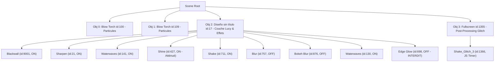

# Spécification Technique Complète — Modèle & Scène Lucy (`3566437475`) 🌌

Ce document constitue la **référence technique absolue et exhaustive** du modèle de fond d'écran animé **Lucy (Cyberpunk: Edgerunners)** sous Hyprland et Wallpaper Engine. Il recense l'intégralité de l'architecture, des assets binaires, des descripteurs JSON, des passes de rendu GLSL, des algorithmes de détourage et des mécanismes d'exécution multi-écrans afin de dispenser tout agent d'un ré-échantillonnage récursif du dossier `ressource/`.

---

## 1. Fiche d'Identité & Origine Workshop

| Propriété | Valeur / Emplacement |
| :--- | :--- |
| **Identifiant Steam Workshop** | `3566437475` |
| **Titre Original** | Lucy - Cyberpunk: Edgerunners [4K / 60 FPS] |
| **Archive Source Originale** | `/home/user/.steam/steam/steamapps/workshop/content/431960/3566437475/scene.pkg.orig` |
| **Dossier Décompressé Steam** | `/home/user/.steam/steam/steamapps/workshop/content/431960/3566437475/` |
| **Dossier Miroir Local (Git)** | [`hyprland_project/ressource/`](file:///home/user/Documents/antigravity/hyprland_project/ressource/) |
| **Résolution Native** | $1920 \times 1080$ (16:9, projection orthogonale) |
| **Cadence Cible (GPU)** | **60 FPS** (Intel UHD 630 sur `DP-1` et `DP-2`) |
| **Cadence Cible (CPU)** | **20 FPS** (Mesa LLVMpipe logiciel) |

---

## 2. Inventaire Exhaustif des Fichiers (`ressource/`)

```
ressource/
├── LUCY_MODEL.md            # Spécification technique maîtresse (ce fichier)
├── README.md                # Guide synthétique d'accès rapide
├── lucy.png                 # Artwork maître 1920x1080 (PNG RGBA 8-bit, 889 Ko)
├── lucy.tex                 # Conteneur binaire TEXV0005 (FIF_PNG, 889 Ko)
├── lucy_model.json          # Descripteur 2D autosize (modèle Wallpaper Engine)
├── lucy_material.json       # Descripteur du matériau 'genericimage4' (translucent)
├── scene.json               # Descripteur de scène maître (passes, bloom, HDR, objets)
├── preview.gif              # Vignette animée officielle (899 Ko)
└── blackwall/               # Effet Blackwall natif GLSL (remplace les particules du workshop)
    ├── blackwall.frag       # Fragment shader GLSL (Fast-Path GPU, glyphes vectorisés)
    ├── blackwall.vert       # Vertex shader GLSL (projection 2D v_TexCoord)
    ├── blackwall_mask.png   # Masque subpixel haute fidélité (fond isolé, 40 Ko)
    ├── blackwall_mask.tex   # Masque compilé en conteneur binaire TEXV0005 (40 Ko)
    ├── blackwall.json       # Descripteur du matériau de l'effet ('effects/blackwall')
    └── effect.json          # Descripteur d'effet pour le runtime Wallpaper Engine
```

### Table de Correspondance avec le Steam Workshop

| Fichier Local (`ressource/`) | Destination Workshop (`~/.steam/.../3566437475/`) | Rôle & Format |
| :--- | :--- | :--- |
| `lucy.tex` | `materials/Diseño sin título.tex` | Texture principale compressée en `TEXV0005` |
| `lucy_model.json` | `models/Diseño sin título.json` | Modèle 2D liant le matériau principal |
| `lucy_material.json` | `materials/Diseño sin título.json` | Définition des passes de texture |
| `scene.json` | `scene.json` | Arbre de rendu et réglages de post-traitement |
| `blackwall/blackwall.frag` | `shaders/effects/blackwall.frag` | Shader de fragment du réseau Blackwall |
| `blackwall/blackwall.vert` | `shaders/effects/blackwall.vert` | Shader de sommet 2D |
| `blackwall/blackwall_mask.tex` | `materials/masks/blackwall_mask.tex` | Masque subpixel binaire |
| `blackwall/blackwall.json` | `materials/effects/blackwall.json` | Matériau de la passe Blackwall |
| `blackwall/effect.json` | `effects/blackwall/effect.json` | Déclaration de l'effet dans `localeffects` |

---

## 3. Architecture de la Scène (`scene.json`)

Le fichier [`scene.json`](file:///home/user/Documents/antigravity/hyprland_project/ressource/scene.json) orchestre l'arbre de rendu complet de Wallpaper Engine.

### 3.1 Paramètres Généraux (`general`)
- **Résolution orthogonale** : `1920x1080` (`orthogonalprojection: { width: 1920, height: 1080 }`).
- **Caméra** : Projection orthogonale, FOV `50.0`, `nearz: 0.01`, `farz: 10000.0`.
- **Stabilisation Caméra** : `camerashake: false` (aucun tremblement global non désiré).
- **Éclairage & Ambiance** : `ambientcolor: "0.30 0.30 0.30"`, `clearcolor: "0.70 0.70 0.70"`.
- **Post-Processing HDR & Bloom** :
  - `hdr: true`
  - `bloom: true`
  - `bloomstrength: 10.0`
  - `bloomthreshold: 0.58`
  - `bloomhdrstrength: 4.08`
  - `bloomhdrthreshold: 1.0`
  - `bloomhdrscatter: 1.619`
  - `bloomhdriterations: 8`
  - `bloomtint: "1.00 1.00 1.00"`

### 3.2 Objets & Hiérarchie des Couches
La scène est découpée en 4 objets hiérarchiques :



#### Détail des Effets sur Lucy (`Obj 2: Diseño sin título`) :
1. **`Blackwall` (id: 9001, actif)** : Fond procédural GLSL haute performance développé sur mesure pour Linux.
2. **`sharpen_filter` (id: 21, actif)** : Filtre d'accentuation pour maximiser la netteté des traits du personnage.
3. **`waterwaves` (ids: 141 & 130, actifs)** : Déformation sinusoïdale fluide simulant la respiration et le vent dans les mèches.
4. **`shine` (id: 427, actif étalonné)** : Passe d'illumination spéculaire dont la vitesse et l'échelle de bruit ont été ralenties (`noisespeed: 0.035`, `noisescale: 1.5`, `noiseamount: 0.25`) pour éliminer tout clignotement oculaire rapide à 60 FPS tout en préservant le piqué et les ombres profondes d'origine.
5. **`shake` (id: 711, actif)** : Micro-secousses cinématiques d'ambiance.
6. **`blur` (id: 757) & `bokeh_blur` (id: 876)** : Désactivés (`visible: false`) pour préserver les performances GPU.
7. ⚠️ **`edge_glow` (id: 698, STRICTEMENT DÉSACTIVÉ)** :
   - **Raison critique** : Sous le pilote OpenGL Linux (Mesa Intel Iris/LLVMpipe), le calcul de diffusion de cette passe sature à $1.0$ sur l'ensemble de la surface du visage.
   - **Symptôme si activé** : Visage entièrement blanc, contraste anéanti.
   - **Consigne** : Conserver impérativement `"visible": false`.

#### Détail du Glitch Plein Écran (`Obj 3: Fullscreen`) :
- **`Shake_Glitch_3` (id: 1366)** : Déclenché par script JavaScript Wallpaper Engine intégré :
  - Intervalle : `glitchInterval = 10.81 s`
  - Durée : `glitchDuration = 1.90 s`
  - Piloté par [`shaders/workshop/2125458920/effects/shake.frag`](file:///home/user/.steam/steam/steamapps/workshop/content/431960/3566437475/shaders/workshop/2125458920/effects/shake.frag).

---

## 4. Shaders GLSL & Optimisations Graphiques

### 4.1 Shader Glitch Relic Rework (`shake.frag`)
- **Emplacement Workshop** : `shaders/workshop/2125458920/effects/shake.frag`
- **Déplacement Géométrique Pur (Zéro Décoloration)** :
  - Suppression intégrale de l'aberration chromatique (pas de décalage RVB baveux).
  - Élimination des teintes jaunes artificielles Relic et des flashs cyan parasites.
  - Échantillonnage direct : `texSample2D(g_Texture0, glitchUV)` garantissant une fidélité chromatique 100% absolue à l'illustration.
- **Slice Jitter Multi-Échelles à 3 Niveaux** :
  - **Niveau 1 (Tranches horizontales)** : Segments de 12% à 57% de l'écran avec wrapping cyclique (`fract(xEnd)`).
  - **Niveau 2 (Blocs rectangulaires 2D)** : Grille $14 \times 32$ avec décalages indépendants en $X$ (0.045) et $Y$ (0.012).
  - **Niveau 3 (Micro-lignes)** : Bandes ultra-fines (hauteur 1/140e, largeur 3% à 18%) pour les saccades haute fréquence.
- **Rythme Temporel & Fréquence Réduite** : Cycle étendu à 12.0s (~5 fois par minute) avec durée pseudo-aléatoire continue entre **1.0 s** et **3.0 s** par hash mathématique, et attaque/relâchement progressifs `smoothstep`. Zéro saccade en dehors de la fenêtre.

### 4.2 Shader Éclat des Yeux (`shine_downsample2.frag`)
- **Emplacement Miroir & Workshop** : `ressource/shaders/effects/shine_downsample2.frag` ➔ `shaders/effects/shine_downsample2.frag`
- **Modulation Temporelle Organique** :
  - Cycle de 11.0s avec fenêtre active de durée aléatoire entre **1.0 s** et **3.0 s** ($D = 1.0 + 2.0 \times \text{hash11}$).
  - Éclat actif uniquement pendant la fenêtre avec fondu entrant/sortant `smoothstep(0.0, 0.25)` / `(1.0 - smoothstep(0.75, 1.0))`.
  - Enveloppe nulle en dehors : yeux au repos complet 80% du temps sans aucun scintillement permanent.

### 4.3 Passe Blackwall GLSL Native (`ressource/blackwall/blackwall.frag`)
- **Contexte** : Le système de particules Windows d'origine ne compile pas sous `linux-wallpaperengine`. Il a été remplacé par une passe procédurale GLSL 60 FPS autonome.
- **Fast-Path GPU Zero-Overhead** :
  ```glsl
  if (mask <= 0.001) {
      gl_FragColor = orig;
      return;
  }
  ```
  Court-circuite le rendu procédural sur **~65% des fragments** (corps, visage et cheveux de Lucy), libérant la bande passante GPU.
- **Vectorisation & Distances sans Racine** :
  - `renderGlyph()` traite 4 canaux simultanément via `vec4 s4 = fract(seed * vec4(7.13, 13.37, 19.81, 29.43))`.
  - Distances euclidiennes calculées via `dot(v, v)` pour éliminer les instructions `sqrt()` matérielles.
- **Composants Visuels Composités** :
  1. *Abîme d'Obsidienne / Sang* : Gradient sombre avec pulsation basse fréquence simulant la respiration de l'IA (`sin(g_Time * 1.6)`).
  2. *Grille Cybernétique 70x40* : Pare-feu rouge cramoisi (`#ff003c`) ondulant verticalement.
  3. *Flux de Données Layer A* : 110 colonnes denses d'arrière-plan à défilement rapide.
  4. *Flux de Données Layer B* : 65 colonnes au premier plan avec têtes d'étincelles cyan (`#00f2ff`) ou blanches et micro-jitter de corruption.
  5. *Lueur Volumétrique (Rim Glow)* : Rétro-éclairage rouge entourant la silhouette de Lucy via `smoothstep(0.0, 0.35, mask) * smoothstep(1.0, 0.55, mask)`.

---

## 5. Détourage Analytique du Fond & Masque Subpixel

### 5.1 Modèle Mathématique du Dégradé d'Arrière-Plan
L'illustration source ne comportant pas de canal alpha, le fond d'origine a été mathématiquement isolé grâce à son gradient vertical linéaire strict :
$$\begin{aligned}
R_{bg}(y) &= y \times \frac{170}{1079} \\
G_{bg}(y) &= 0 \\
B_{bg}(y) &= y \times \frac{88}{1079}
\end{aligned}$$

### 5.2 Algorithme de Génération du Masque (`scripts/wallpaper_tool.py mask`)
1. **Écart Euclidien ($D$)** : Calcul de la distance couleur pour chaque pixel $(x, y)$ :
   $$D(x, y) = \sqrt{(R - R_{bg})^2 + G^2 + (B - B_{bg})^2}$$
2. **Ensemencement Global** : Tout pixel avec $D \le 1.8$ est identifié avec certitude comme appartenant au fond.
3. **Propagation BFS Subpixel** : File de priorité propageant le masque à travers les mèches semi-transparentes tant que $D < 18.0$.
4. **Lissage Polynomial Smoothstep** :
   $$t = \frac{D - 1.8}{18.0 - 1.8}, \quad \text{smooth} = t^2 \times (3 - 2t), \quad \alpha = (1 - \text{smooth}) \times 255$$
5. **Préservation Anatomique & Nettoyage** :
   - Fente cou/dos préservée : Zone $X \in [1340, 1490], Y \in [650, 1010]$ protégée de toute perforation.
   - Bruit isolé supprimé : Composantes connexes $< 10\text{ px}$ éliminées.
   - Détourage interdigital : Suppression des patchs opaques entre les doigts :
     - Main supérieure : $X \in [984, 1004], Y \in [786, 814]$ ($R - G \ge 75 \implies \text{fond}$).
     - Main inférieure : $X \in [878, 938], Y \in [896, 934]$ ($R - G \ge 75 \implies \text{fond}$).

---

## 6. Structure Binaire des Conteneurs TEX (`TEXV0005`)

Wallpaper Engine utilise un conteneur binaire propriétaire pour encapsuler ses textures.

### 6.1 Spécification de l'En-tête

| Décalage (Offset) | Type / Longueur | Valeur / Rôle |
| :--- | :--- | :--- |
| `0x00 - 0x08` | `char[9]` | Magic de version : `TEXV0005\0` |
| `0x09 - 0x11` | `char[9]` | Header d'image : `TEXI0001\0` |
| `0x12 - 0x2D` | `uint32[7]` | `format=0`, `flags=2` (ClampUVs), `w=1920`, `h=1080`, `img_w=1920`, `img_h=1080`, `unk=0` |
| `0x2E - 0x36` | `char[9]` | Header de bloc : `TEXB0004\0` |
| `0x37 - 0x42` | `uint32[3]` | `imageCount=1`, `freeImageFormat=13` (`FIF_PNG`), `isMp4=0` |
| `0x43 - 0x46` | `uint32[1]` | `mipmapCount=1` |
| `0x47 - 0x56` | `uint32[2], int32[3]` | Entrée Mipmap : `w=1920`, `h=1080`, `compression=0`, `uncompressedSize`, `compressedSize` |
| `0x57...` | Données binaires | Flux PNG standard (`\x89PNG\r\n\x1a\n...`) |

### 6.2 Outils de Conversion CLI
- **PNG ➔ TEX** : `./scripts/wallpaper_tool.py pack <image.png> <texture.tex>`
- **TEX ➔ PNG** : `./scripts/wallpaper_tool.py unpack <texture.tex> <image.png>`

---

## 7. Moteur d'Exécution & Architecture Multi-Écrans

### 7.1 Résolution du Bug d'Écran Blanc (Patch `app.asar`)
- Sous Wayland / Hyprland, instancier plusieurs moniteurs sous un même processus binaire (`linux-wallpaperengine --screen-root DP-1 --screen-root DP-2`) provoque la corruption du contexte EGL et un écran blanc sur l'écran secondaire.
- **Solution appliquée** : Découpage multi-processus dans `/usr/lib/linux-wallpaper-engine/resources/app.asar` (méthode `spawnForScreens`). Chaque écran dispose d'un processus dédié indépendant.

### 7.2 Configuration du Rendu (GPU vs CPU)
Le fichier [`dotfiles/hypr/wallpaper_renderer.json`](file:///home/user/Documents/antigravity/hyprland_project/dotfiles/hypr/wallpaper_renderer.json) pilote le moteur :

```json
{
  "renderer": "gpu",
  "fps_gpu": 60,
  "fps_cpu": 20
}
```

- **Mode GPU (Recommandé & Actif)** :
  - Périphérique matériel : `/dev/dri/renderD128` (Intel UHD Graphics 630).
  - Cadence : **60 FPS**.
  - Fréquence iGPU dynamique : 350 MHz à 1050 MHz.
  - Consommation CPU : ~6% à 9% par écran.
- **Mode CPU (Secours / Économie)** :
  - Moteur logiciel : Mesa LLVMpipe (`LIBGL_ALWAYS_SOFTWARE=1`, `GALLIUM_DRIVER=llvmpipe`).
  - Cadence : **20 FPS**.
  - Pression CPU : ~18% à 25%.

### 7.3 Empilement des Couches Wayland (Hyprland Layer Shell)
```
Layer 3 (Overlay)    : Wofi, Hyprlock, Spotify Card Flottante
Layer 2 (Top)        : Waybar (barre supérieure translucide)
Layer 1 (Bottom)     : linux-wallpaperengine (Lucy 60 FPS sur DP-1 & DP-2)
Layer 0 (Background) : swaybg (fond statique secours en ~10 ms)
```

---

## 8. Commandes de Maintenance Rapide (`scripts/wallpaper_tool.py`)

| Commande | Action & Effet |
| :--- | :--- |
| `./scripts/wallpaper_tool.py status` | Affiche l'état des processus, PIDs, moniteurs, charge CPU, RAM et couches Wayland |
| `./scripts/wallpaper_tool.py renderer` | Affiche le mode de rendu actif et les cadences FPS |
| `./scripts/wallpaper_tool.py renderer gpu` | Bascule Lucy sur GPU Intel UHD 630 @ **60 FPS** |
| `./scripts/wallpaper_tool.py renderer cpu` | Bascule Lucy sur rendu logiciel Mesa LLVMpipe @ 20 FPS |
| `./scripts/wallpaper_tool.py mask` | Recalcule le masque subpixel Blackwall et génère `blackwall_mask.tex` |
| `./scripts/wallpaper_tool.py sync` | Déploie `ressource/` (shaders, textures, scene.json) vers le Steam Workshop |
| `./scripts/wallpaper_tool.py restart` | Redémarre proprement les processus sur `DP-1` et `DP-2` |
| `./scripts/wallpaper_tool.py check-links` | Audite la stricte intégrité des hard links entre `dotfiles/` et `~/.config/` |
