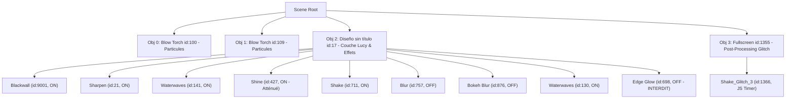

# Spécification Technique Complète — Modèle & Scène Lucy (`3566437475`) 🌌

Ce document constitue la **référence technique absolue et exhaustive** du modèle de fond d'écran animé **Lucy (Cyberpunk: Edgerunners)** sous Hyprland et Wallpaper Engine. Il recense l'intégralité de l'architecture, des assets binaires, des descripteurs JSON, des passes de rendu GLSL, des algorithmes de détourage et des mécanismes d'exécution multi-écrans afin de dispenser tout agent d'un ré-échantillonnage récursif du dossier `ressource/`.

---

## 1. Fiche d'Identité & Origine Workshop

| Propriété | Valeur / Emplacement |
| :--- | :--- |
| **Identifiant Steam Workshop** | `3566437475` |
| **Titre Original** | Lucy - Cyberpunk: Edgerunners [4K / 60 FPS] |
| **Archive Source Originale** | `/home/user/.steam/steam/steamapps/workshop/content/431960/3566437475/scene.pkg.orig` |
| **Dossier Décompressé Steam** | `/home/user/.steam/steam/steamapps/workshop/content/431960/3566437475/` |
| **Dossier Miroir Local (Git)** | [`hyprland_project/ressource/`](file:///home/user/Documents/antigravity/hyprland_project/ressource/) |
| **Résolution Native** | $1920 \times 1080$ (16:9, projection orthogonale) |
| **Cadence Cible (GPU)** | **60 FPS** (Intel UHD 630 sur `DP-1` et `DP-2`) |
| **Cadence Cible (CPU)** | **20 FPS** (Mesa LLVMpipe logiciel) |

---

## 2. Inventaire Exhaustif des Fichiers (`ressource/`)

```
ressource/
├── LUCY_MODEL.md            # Spécification technique maîtresse (ce fichier)
├── README.md                # Guide synthétique d'accès rapide
├── lucy.png                 # Artwork maître 1920x1080 (PNG RGBA 8-bit, 889 Ko)
├── lucy.tex                 # Conteneur binaire TEXV0005 (FIF_PNG, 889 Ko)
├── lucy_model.json          # Descripteur 2D autosize (modèle Wallpaper Engine)
├── lucy_material.json       # Descripteur du matériau 'genericimage4' (translucent)
├── scene.json               # Descripteur de scène maître (passes, bloom, HDR, objets)
├── preview.gif              # Vignette animée officielle (899 Ko)
├── shaders/                 # Shaders GLSL customisés (glitch géométrique, shine yeux)
│   ├── workshop/2125458920/effects/shake.frag # Glitch pur sans aberration chromatique ni teinte
│   └── effects/             # Passes d'éclat oculaire optimisées (shine_downsample2, etc.)
└── blackwall/               # Effet Blackwall natif GLSL (remplace les particules du workshop)
    ├── blackwall.frag       # Fragment shader GLSL (Fast-Path GPU, glyphes vectorisés)
    ├── blackwall.vert       # Vertex shader GLSL (projection 2D v_TexCoord)
    ├── blackwall_mask.png   # Masque subpixel haute fidélité (fond isolé, 40 Ko)
    ├── blackwall_mask.tex   # Masque compilé en conteneur binaire TEXV0005 (40 Ko)
    ├── blackwall.json       # Descripteur du matériau de l'effet ('effects/blackwall')
    └── effect.json          # Descripteur d'effet pour le runtime Wallpaper Engine
```

### Table de Correspondance avec le Steam Workshop

| Fichier Local (`ressource/`) | Destination Workshop (`~/.steam/.../3566437475/`) | Rôle & Format |
| :--- | :--- | :--- |
| `lucy.tex` | `materials/Diseño sin título.tex` | Texture principale compressée en `TEXV0005` |
| `lucy_model.json` | `models/Diseño sin título.json` | Modèle 2D liant le matériau principal |
| `lucy_material.json` | `materials/Diseño sin título.json` | Définition des passes de texture |
| `scene.json` | `scene.json` | Arbre de rendu et réglages de post-traitement |
| `shaders/workshop/2125458920/effects/shake.frag` | `shaders/workshop/2125458920/effects/shake.frag` | Glitch géométrique pur sans distorsion RVB |
| `shaders/effects/*` | `shaders/effects/*` | Passes d'éclat oculaire étalonnées |
| `blackwall/blackwall.frag` | `shaders/effects/blackwall.frag` | Shader de fragment du réseau Blackwall |
| `blackwall/blackwall.vert` | `shaders/effects/blackwall.vert` | Shader de sommet 2D |
| `blackwall/blackwall_mask.tex` | `materials/masks/blackwall_mask.tex` | Masque subpixel binaire |
| `blackwall/blackwall.json` | `materials/effects/blackwall.json` | Matériau de la passe Blackwall |
| `blackwall/effect.json` | `effects/blackwall/effect.json` | Déclaration de l'effet dans `localeffects` |

---

## 3. Architecture de la Scène (`scene.json`)

Le fichier [`scene.json`](file:///home/user/Documents/antigravity/hyprland_project/ressource/scene.json) orchestre l'arbre de rendu complet de Wallpaper Engine.

### 3.1 Paramètres Généraux (`general`)
- **Résolution orthogonale** : `1920x1080` (`orthogonalprojection: { width: 1920, height: 1080 }`).
- **Caméra** : Projection orthogonale, FOV `50.0`, `nearz: 0.01`, `farz: 10000.0`.
- **Stabilisation Caméra** : `camerashake: false` (aucun tremblement global non désiré).
- **Éclairage & Ambiance** : `ambientcolor: "0.30 0.30 0.30"`, `clearcolor: "0.70 0.70 0.70"`.
- **Post-Processing HDR & Bloom** :
  - `hdr: true`
  - `bloom: true`
  - `bloomstrength: 10.0`
  - `bloomthreshold: 0.58`
  - `bloomhdrstrength: 4.08`
  - `bloomhdrthreshold: 1.0`
  - `bloomhdrscatter: 1.619`
  - `bloomhdriterations: 8`
  - `bloomtint: "1.00 1.00 1.00"`

### 3.2 Objets & Hiérarchie des Couches
La scène est découpée en 4 objets hiérarchiques :



#### Détail des Effets sur Lucy (`Obj 2: Diseño sin título`) :
1. **`Blackwall` (id: 9001, actif)** : Fond procédural GLSL haute performance développé sur mesure pour Linux.
2. **`sharpen_filter` (id: 21, actif)** : Filtre d'accentuation pour maximiser la netteté des traits du personnage.
3. **`waterwaves` (ids: 141 & 130, actifs)** : Déformation sinusoïdale fluide simulant la respiration et le vent dans les mèches.
4. **`shine` (id: 427, actif étalonné)** : Passe d'illumination spéculaire dont la vitesse et l'échelle de bruit ont été ralenties (`noisespeed: 0.035`, `noisescale: 1.5`, `noiseamount: 0.25`) pour éliminer tout clignotement oculaire rapide à 60 FPS tout en préservant le piqué et les ombres profondes d'origine.
5. **`shake` (id: 711, actif)** : Micro-secousses cinématiques d'ambiance.
6. **`blur` (id: 757) & `bokeh_blur` (id: 876)** : Désactivés (`visible: false`) pour préserver les performances GPU.
7. ⚠️ **`edge_glow` (id: 698, STRICTEMENT DÉSACTIVÉ)** :
   - **Raison critique** : Sous le pilote OpenGL Linux (Mesa Intel Iris/LLVMpipe), le calcul de diffusion de cette passe sature à $1.0$ sur l'ensemble de la surface du visage.
   - **Symptôme si activé** : Visage entièrement blanc, contraste anéanti.
   - **Consigne** : Conserver impérativement `"visible": false`.

#### Détail du Glitch Plein Écran (`Obj 3: Fullscreen`) :
- **`Shake_Glitch_3` (id: 1366)** : Déclenché par script JavaScript Wallpaper Engine intégré :
  - Intervalle : `glitchInterval = 10.81 s`
  - Durée : `glitchDuration = 1.90 s`
  - Piloté par [`shaders/workshop/2125458920/effects/shake.frag`](file:///home/user/.steam/steam/steamapps/workshop/content/431960/3566437475/shaders/workshop/2125458920/effects/shake.frag).

---

## 4. Shaders GLSL & Optimisations Graphiques

### 4.1 Shader Glitch Relic Rework (`shake.frag`)
- **Emplacement Miroir (Git)** : [`ressource/shaders/workshop/2125458920/effects/shake.frag`](file:///home/user/Documents/antigravity/hyprland_project/ressource/shaders/workshop/2125458920/effects/shake.frag)
- **Destination Workshop** : `~/.steam/.../3566437475/shaders/workshop/2125458920/effects/shake.frag`
- **Mécanisme VFS & Priorité du Runtime** :
  - `linux-wallpaperengine` monte par défaut `scene.pkg` à la racine `/` du VFS virtuel (`WallpaperApplication.cpp:88`).
  - Si `scene.pkg` est présent, les shaders originaux du créateur (aberration chromatique baveuse, flashs jaune Relic, scanlines assombrissantes) écrasent les fichiers décompressés sur disque.
  - La routine `sync_to_workshop()` décompresse automatiquement les 80 fichiers de l'archive et renomme `scene.pkg` en `scene.pkg.orig` pour garantir le chargement exclusif du shader customisé.

#### A. Principes Visuels & Fidélité Chromatique Absolue (Zéro Dispersion)
1. **Suppression Totale de l'Aberration Chromatique** :
   - Élimination des décalages de coordonnées par composante (`redUV`, `blueUV`). Aucun liseré rouge ou bleu ne bave sur les mèches blanches ou les yeux.
2. **Suppression des Voiles Colorés & Flashs Parasites** :
   - Retrait des teintes jaune Relic, des filtres cyan et des barres d'assombrissement artificielles.
   - Les noirs profonds du fond Blackwall, les dégradés cyan/mauve des cheveux et l'iris rose néon conservent 100% de leur colorimétrie native via un échantillonnage direct `texSample2D(g_Texture0, glitchUV)`.
3. **Calme Visuel & Équilibre (Zéro Surcharge)** :
   - Aucun effet de flou ou d'écho fantôme résiduel (qui créait une sensation de flou de bougé indésirable).
   - Aucune coupure noire (drop-out) ni sursaut de luminosité blanc. L'image reste cristalline et nette.

#### B. Rythme Temporel & Cadence « Snappy » (Double-Tap Discret)
- **Période Globale** : Cycle posé de **$3.80\,\text{s}$** (`mod(time, 3.8)` avec `time = g_Time * 1.5`).
- **Repos Visuel Absolu** : Pendant **$90\%$ du cycle** ($t \in [0.00\,\text{s}, 3.20\,\text{s}[$ et $t \in ]3.43\,\text{s}, 3.80\,\text{s}]$), l'intensité est strictement nulle ($0.0$). L'écran est totalement immobile.
- **Double Impulsion Instantanée (Pas de glissement gélatineux)** :
  Au lieu d'une interpolation continue `smoothstep` de 450 ms qui faisait glisser mollement l'image comme de la gelée, la secousse est quantifiée en échelons instantanés nets :
  - **Tic 1 (Choc principal)** : $t \in [3.20\,\text{s}, 3.30\,\text{s}]$ (durée : $100\,\text{ms}$, intensité : $1.0$).
  - **Inter-tic (Micro-pause)** : $t \in ]3.30\,\text{s}, 3.35\,\text{s}[$ (durée : $50\,\text{ms}$, pause nette à $0.0$).
  - **Tic 2 (Réplique secondaire)** : $t \in [3.35\,\text{s}, 3.43\,\text{s}]$ (durée : $80\,\text{ms}$, intensité : $0.7$).
  - **Micro-secousse sporadique** : Déclenchement pseudo-aléatoire très rare ($< 1.8\%$ des trames) via `step(0.982, hash11(floor(time * 10.0))) * 0.45`.

#### C. Découpe Géométrique Multi-Tailles & Variabilité Strictement Bornée
Le déplacement spatial opère simultanément sur 4 échelles asymétriques indépendantes sans rupture de grille :

1. **Grandes Tranches Épaisses (Sections Focalisées)** :
   - **Hauteur au pixel près** : Calibrée strictement entre **$50\,\text{px}$ et $75\,\text{px}$** :
     $$\text{macroY} = \text{uv.y} \times 14.4, \quad \text{macroIndex} = \lfloor \text{macroY} \rfloor, \quad \text{localY} = \text{fract}(\text{macroY}) \times 75.0$$
     $$\text{macroHeight} = \text{hash11}(\text{macroSeed} \times 3.77) \times 25.0 + 50.0 \quad \in [50\,\text{px}, 75\,\text{px}]$$
   - **Largeur variable (Asymétrique)** : Strictement bornée entre **$25\%$ et $50\%$** de l'écran :
     $$x_{\text{width}} = \text{hash11}(\text{macroSeed} \times 5.43) \times 0.25 + 0.25 \quad \in [0.25, 0.50]$$
   - **Déplacement net** : Décalage horizontal franc $\Delta X = (\text{hash} - 0.5) \times 0.075 \times \text{intensity}$ encapsulé dans le helper `isInsideSpan` avec repliement toroïdal (`fract(xEnd)`).
2. **Tranches Moyennes** :
   - **Hauteur** : $\sim 25\,\text{px}$ à $45\,\text{px}$ ($\lfloor \text{uv.y} \times 30.0 \rfloor$).
   - **Largeur variable** : **$25\%$ à $50\%$** de l'écran.
   - **Déplacement** : $\Delta X = (\text{hash} - 0.5) \times 0.050 \times \text{intensity}$.
3. **Tranches Fines** :
   - **Hauteur** : $\sim 10\,\text{px}$ à $18\,\text{px}$ ($\lfloor \text{uv.y} \times 65.0 \rfloor$).
   - **Largeur variable** : **$25\%$ à $50\%$** de l'écran.
   - **Déplacement** : $\Delta X = (\text{hash} - 0.5) \times 0.035 \times \text{intensity}$.
4. **Blocs Rectangulaires 2D (Pavés de Corruption VRAM)** :
   - **Gros blocs massifs** : Grille $8 \times 16$ (hauteur fixe de $67.5\,\text{px}$, largeur $240\,\text{px}$). Décalage 2D : $\Delta X = \pm 0.030$, $\Delta Y = \pm 0.0075$.
   - **Blocs moyens** : Grille $18 \times 28$ (hauteur $38.5\,\text{px}$, largeur $106\,\text{px}$). Décalage 2D : $\Delta X = \pm 0.020$, $\Delta Y = \pm 0.0040$.

#### D. Code Source GLSL Intégral Annoté (`shake.frag`)
```glsl
#include "common.h"

varying vec4 v_TexCoord;

uniform sampler2D g_Texture0; // {"material":"framebuffer","hidden":true}
uniform float g_Time;

// ============================================================================
// CONFIGURATION DU GLITCH (CONSTANTES NOMMÉES)
// ============================================================================
const float TIME_SCALE      = 1.5;
const float CYCLE_PERIOD    = 3.8;
const float TICK1_START     = 3.20;
const float TICK1_END       = 3.30;
const float TICK2_START     = 3.35;
const float TICK2_END       = 3.43;
const float TICK2_WEIGHT    = 0.70;
const float TWITCH_RATE     = 10.0;
const float TWITCH_THRESH   = 0.982;
const float TWITCH_WEIGHT   = 0.45;

// Géométrie des tranches
const float MACRO_FREQ      = 14.4; // 1080.0 / 75.0 (tranches de 75px de période)
const float MACRO_MIN_H     = 50.0; // Hauteur minimale 50px
const float MACRO_VAR_H     = 25.0; // Plage de variation 50px à 75px
const float WIDTH_BASE      = 0.25; // Largeur minimale (25%)
const float WIDTH_RANGE     = 0.25; // Plage variable (25% à 50%)

// ============================================================================
// FONCTIONS DE HACHAGE & HELPERS
// ============================================================================
float hash11(float p) {
    p = fract(p * 0.1031);
    p *= p + 33.33;
    p *= p + p;
    return fract(p);
}

float hash21(vec2 p) {
    vec3 p3 = fract(vec3(p.xyx) * 0.1031);
    p3 += dot(p3, p3.yzx + 33.33);
    return fract((p3.x + p3.y) * p3.z);
}

// Vérification d'intervalle horizontal avec bouclage torique (DRY)
bool isInsideSpan(float x, float xStart, float xWidth) {
    float xEnd = xStart + xWidth;
    return (x >= xStart && x <= xEnd) || (xEnd > 1.0 && x <= fract(xEnd));
}

// ============================================================================
// MAIN SHADER PIPELINE
// ============================================================================
void main() {
    vec2 uv = v_TexCoord.xy;
    float time = g_Time * TIME_SCALE;

    // 1. Rythme posé : secousse nette et brève toutes les ~3.8s (calme absolu 90% du temps)
    float cycle = mod(time, CYCLE_PERIOD);

    // Double-tic sec et instantané (pas de glissement mou)
    float tick1 = step(TICK1_START, cycle) * (1.0 - step(TICK1_END, cycle)); // Choc principal franc (100ms)
    float tick2 = step(TICK2_START, cycle) * (1.0 - step(TICK2_END, cycle)) * TICK2_WEIGHT; // Réplique secondaire (80ms)
    float twitch = step(TWITCH_THRESH, hash11(floor(time * TWITCH_RATE))) * TWITCH_WEIGHT; // Micro-saccade rare
    float intensity = max(max(tick1, tick2), twitch);

    // -------------------------------------------------------------------------
    // FAST-PATH EARLY EXIT (Optimisation GPU 90% du temps)
    // -------------------------------------------------------------------------
    if (intensity <= 0.005) {
        gl_FragColor = texSample2D(g_Texture0, uv);
        return;
    }

    vec2 glitchUV = uv;
    float frameSeed = floor(time * 20.0) * 23.41;

    // =========================================================================
    // A. GRANDES TRANCHES ÉPAISSES (Hauteur exacte 50px à 75px, largeur 25%-50%)
    // =========================================================================
    float macroY = uv.y * MACRO_FREQ;
    float macroIndex = floor(macroY);
    float macroSeed = macroIndex + frameSeed;
    float macroHeight = hash11(macroSeed * 3.77) * MACRO_VAR_H + MACRO_MIN_H; // 50px à 75px
    float localY = fract(macroY) * 75.0; // Optimisation ALU : fract au lieu de mod

    if (hash11(macroSeed) > 0.65 && localY <= macroHeight) {
        float xStart = hash11(macroSeed * 2.17);
        float xWidth = hash11(macroSeed * 5.43) * WIDTH_RANGE + WIDTH_BASE;

        if (isInsideSpan(uv.x, xStart, xWidth)) {
            float macroShift = (hash11(macroSeed * 9.13) - 0.5) * 0.075 * intensity;
            glitchUV.x += macroShift;
        }
    }

    // =========================================================================
    // B. TRANCHES MOYENNES (Hauteur ~25-45px, largeur variable 25%-50%)
    // =========================================================================
    float midY = floor(uv.y * 30.0);
    float midSeed = midY + frameSeed * 1.47;
    if (hash11(midSeed) > 0.60) {
        float xStart = hash11(midSeed * 1.83);
        float xWidth = hash11(midSeed * 4.61) * WIDTH_RANGE + WIDTH_BASE;

        if (isInsideSpan(uv.x, xStart, xWidth)) {
            float midShift = (hash11(midSeed * 7.77) - 0.5) * 0.050 * intensity;
            glitchUV.x += midShift;
        }
    }

    // =========================================================================
    // C. TRANCHES FINES (Hauteur ~10-18px, largeur variable 25%-50%)
    // =========================================================================
    float fineY = floor(uv.y * 65.0);
    float fineSeed = fineY + frameSeed * 2.19;
    if (hash11(fineSeed) > 0.72) {
        float xStart = hash11(fineSeed * 3.11);
        float xWidth = hash11(fineSeed * 6.29) * WIDTH_RANGE + WIDTH_BASE;

        if (isInsideSpan(uv.x, xStart, xWidth)) {
            float fineShift = (hash11(fineSeed * 11.23) - 0.5) * 0.035 * intensity;
            glitchUV.x += fineShift;
        }
    }

    // =========================================================================
    // D. BLOCS RECTANGULAIRES 2D (Pavés francs de tailles variables)
    // =========================================================================
    // 1. Gros blocs francs (grille 8x16 : 67.5px de haut, décrochages massifs localisés)
    vec2 macroCell = floor(uv * vec2(8.0, 16.0));
    float macroBlockSeed = hash21(macroCell + frameSeed);
    if (macroBlockSeed > 0.88) {
        vec2 bShift = (vec2(hash21(macroCell * 2.7 + 1.1), hash21(macroCell * 6.1 + 3.7)) - 0.5) 
                      * vec2(0.060, 0.015) * intensity;
        glitchUV += bShift;
    }

    // 2. Blocs moyens (grille 18x28, détails nets)
    vec2 midCell = floor(uv * vec2(18.0, 28.0));
    float midBlockSeed = hash21(midCell + frameSeed * 1.33);
    if (midBlockSeed > 0.87) {
        vec2 bShift = (vec2(hash21(midCell * 3.9 + 1.4), hash21(midCell * 8.3 + 4.7)) - 0.5) 
                      * vec2(0.040, 0.008) * intensity;
        glitchUV += bShift;
    }

    // Échantillonnage direct 100% fidèle : couleurs d'origine pures, zéro flash, zéro flou
    gl_FragColor = texSample2D(g_Texture0, glitchUV);
}
```

### 4.2 Shader Éclat des Yeux (`shine_downsample2.frag`)
- **Emplacement Miroir & Workshop** : `ressource/shaders/effects/shine_downsample2.frag` ➔ `shaders/effects/shine_downsample2.frag`
- **Modulation Temporelle Non Périodique à Double Variabilité (Stateless GLSL)** :
  - **Réseau temporel à gigue 1D** : Résout l'absence d'état persistant en GLSL par un échantillonnage sur 3 fenêtres locales $k \in [k_0 - 1, k_0 + 1]$ avec pas $T_{\text{step}} = 28.0\,\text{s}$ et gigue $\text{jitter}(k) \in [-6.0\,\text{s}, +6.0\,\text{s}]$.
  - **Durée active variable** : Chaque illumination dure de manière pseudo-aléatoire entre **3.5 s** et **8.5 s** ($D = 3.5 + 5.0 \times \text{hash11}$).
  - **Pause de repos variable** : Chaque intervalle de retour à la normale est imprévisible et non périodique, oscillant entre **16.0 s** et **29.0 s** ($P = 28.0 + \Delta\text{jitter} - D$).
  - **Cycle 0 instantané** : Démarrage immédiat à $t = 0.5\,\text{s}$ ($D_0 = 5.0\,\text{s}$) pour validation visuelle instantanée sans attente initiale.
  - **Enveloppe à plateau trapézoïdal** : Montée douce (0.0 à 0.2), maintien stable et constant sans scintillement (0.2 à 0.8), descente fluide (0.8 à 1.0).
  - **Retour neutre absolu** : En dehors des fenêtres actives ($x < 0$ ou $x > 1$), l'enveloppe est strictement nulle ($0.0$), restituant l'illustration native sans aucune lueur résiduelle.
  - **Écrasement systématique des FBOs** : `alpha = 1.0` impératif éliminant l'accumulation/saturation résiduelle sous `blending: "normal"`.
- **Chromatisme Continu Anti-Scintillement** :
  - Pondération spectrale continue `mix()` sur les canaux dominants cyan (`#00f0ff`) et magenta (`#e0287d`), éradiquant les sauts discrets et le clignotement haute fréquence.
- **Élimination de la Boule Lumineuse & Pass-Through (`shine_cast.frag` & `shine_gaussian.frag`)** :
  - Remplacement du lancer de rayons 5 directions et du flou gaussien 13-tap par des passes directes `pass-through`.
  - Suppression totale du halo sphérique externe ("boule de lumière") bavant sur les paupières et l'orbite.
  - L'illumination est confinée à 100% à l'intérieur de l'iris et de la pupille sans aucun débordement.
- **Paramètres de Rayonnement (`scene.json` Pass 429, 430, 431)** :
  - `raylength: 0.0` et `scale: "0 0"` : désactivation totale de l'étalement spatial des rayons et du flou.

### 4.3 Passe Blackwall GLSL Native (`ressource/blackwall/blackwall.frag`)
- **Contexte** : Le système de particules Windows d'origine ne compile pas sous `linux-wallpaperengine`. Il a été remplacé par une passe procédurale GLSL 60 FPS autonome.
- **Fast-Path GPU Zero-Overhead** :
  ```glsl
  if (mask <= 0.001) {
      gl_FragColor = orig;
      return;
  }
  ```
  Court-circuite le rendu procédural sur **~65% des fragments** (corps, visage et cheveux de Lucy), libérant la bande passante GPU.
- **Vectorisation & Distances sans Racine** :
  - `renderGlyph()` traite 4 canaux simultanément via `vec4 s4 = fract(seed * vec4(7.13, 13.37, 19.81, 29.43))`.
  - Distances euclidiennes calculées via `dot(v, v)` pour éliminer les instructions `sqrt()` matérielles.
- **Composants Visuels Composités** :
  1. *Abîme d'Obsidienne / Sang* : Gradient sombre avec pulsation basse fréquence simulant la respiration de l'IA (`sin(g_Time * 1.6)`).
  2. *Grille Cybernétique 70x40* : Pare-feu rouge cramoisi (`#ff003c`) ondulant verticalement.
  3. *Flux de Données Layer A* : 110 colonnes denses d'arrière-plan à défilement rapide.
  4. *Flux de Données Layer B* : 65 colonnes au premier plan avec têtes d'étincelles cyan (`#00f2ff`) ou blanches et micro-jitter de corruption.
  5. *Lueur Volumétrique (Rim Glow)* : Rétro-éclairage rouge entourant la silhouette de Lucy via `smoothstep(0.0, 0.35, mask) * smoothstep(1.0, 0.55, mask)`.

---

## 5. Détourage Analytique du Fond & Masque Subpixel

### 5.1 Modèle Mathématique du Dégradé d'Arrière-Plan
L'illustration source ne comportant pas de canal alpha, le fond d'origine a été mathématiquement isolé grâce à son gradient vertical linéaire strict :
$$\begin{aligned}
R_{bg}(y) &= y \times \frac{170}{1079} \\
G_{bg}(y) &= 0 \\
B_{bg}(y) &= y \times \frac{88}{1079}
\end{aligned}$$

### 5.2 Algorithme de Génération du Masque (`scripts/wallpaper_tool.py mask`)
1. **Écart Euclidien ($D$)** : Calcul de la distance couleur pour chaque pixel $(x, y)$ :
   $$D(x, y) = \sqrt{(R - R_{bg})^2 + G^2 + (B - B_{bg})^2}$$
2. **Ensemencement Global** : Tout pixel avec $D \le 1.8$ est identifié avec certitude comme appartenant au fond.
3. **Propagation BFS Subpixel** : File de priorité propageant le masque à travers les mèches semi-transparentes tant que $D < 18.0$.
4. **Lissage Polynomial Smoothstep** :
   $$t = \frac{D - 1.8}{18.0 - 1.8}, \quad \text{smooth} = t^2 \times (3 - 2t), \quad \alpha = (1 - \text{smooth}) \times 255$$
5. **Préservation Anatomique & Nettoyage** :
   - Fente cou/dos préservée : Zone $X \in [1340, 1490], Y \in [650, 1010]$ protégée de toute perforation.
   - Bruit isolé supprimé : Composantes connexes $< 10\text{ px}$ éliminées.
   - Détourage interdigital : Suppression des patchs opaques entre les doigts :
     - Main supérieure : $X \in [984, 1004], Y \in [786, 814]$ ($R - G \ge 75 \implies \text{fond}$).
     - Main inférieure : $X \in [878, 938], Y \in [896, 934]$ ($R - G \ge 75 \implies \text{fond}$).

---

## 6. Structure Binaire des Conteneurs TEX (`TEXV0005`)

Wallpaper Engine utilise un conteneur binaire propriétaire pour encapsuler ses textures.

### 6.1 Spécification de l'En-tête

| Décalage (Offset) | Type / Longueur | Valeur / Rôle |
| :--- | :--- | :--- |
| `0x00 - 0x08` | `char[9]` | Magic de version : `TEXV0005\0` |
| `0x09 - 0x11` | `char[9]` | Header d'image : `TEXI0001\0` |
| `0x12 - 0x2D` | `uint32[7]` | `format=0`, `flags=2` (ClampUVs), `w=1920`, `h=1080`, `img_w=1920`, `img_h=1080`, `unk=0` |
| `0x2E - 0x36` | `char[9]` | Header de bloc : `TEXB0004\0` |
| `0x37 - 0x42` | `uint32[3]` | `imageCount=1`, `freeImageFormat=13` (`FIF_PNG`), `isMp4=0` |
| `0x43 - 0x46` | `uint32[1]` | `mipmapCount=1` |
| `0x47 - 0x56` | `uint32[2], int32[3]` | Entrée Mipmap : `w=1920`, `h=1080`, `compression=0`, `uncompressedSize`, `compressedSize` |
| `0x57...` | Données binaires | Flux PNG standard (`\x89PNG\r\n\x1a\n...`) |

### 6.2 Outils de Conversion CLI
- **PNG ➔ TEX** : `./scripts/wallpaper_tool.py pack <image.png> <texture.tex>`
- **TEX ➔ PNG** : `./scripts/wallpaper_tool.py unpack <texture.tex> <image.png>`

---

## 7. Moteur d'Exécution & Architecture Multi-Écrans

### 7.1 Résolution du Bug d'Écran Blanc (Patch `app.asar`)
- Sous Wayland / Hyprland, instancier plusieurs moniteurs sous un même processus binaire (`linux-wallpaperengine --screen-root DP-1 --screen-root DP-2`) provoque la corruption du contexte EGL et un écran blanc sur l'écran secondaire.
- **Solution appliquée** : Découpage multi-processus dans `/usr/lib/linux-wallpaper-engine/resources/app.asar` (méthode `spawnForScreens`). Chaque écran dispose d'un processus dédié indépendant.

### 7.2 Configuration du Rendu (GPU vs CPU)
Le fichier [`dotfiles/hypr/wallpaper_renderer.json`](file:///home/user/Documents/antigravity/hyprland_project/dotfiles/hypr/wallpaper_renderer.json) pilote le moteur :

```json
{
  "renderer": "gpu",
  "fps_gpu": 60,
  "fps_cpu": 20
}
```

- **Mode GPU (Recommandé & Actif)** :
  - Périphérique matériel : `/dev/dri/renderD128` (Intel UHD Graphics 630).
  - Cadence : **60 FPS**.
  - Fréquence iGPU dynamique : 350 MHz à 1050 MHz.
  - Consommation CPU : ~6% à 9% par écran.
- **Mode CPU (Secours / Économie)** :
  - Moteur logiciel : Mesa LLVMpipe (`LIBGL_ALWAYS_SOFTWARE=1`, `GALLIUM_DRIVER=llvmpipe`).
  - Cadence : **20 FPS**.
  - Pression CPU : ~18% à 25%.

### 7.3 Empilement des Couches Wayland (Hyprland Layer Shell)
```
Layer 3 (Overlay)    : Wofi, Hyprlock, Spotify Card Flottante
Layer 2 (Top)        : Waybar (barre supérieure translucide)
Layer 1 (Bottom)     : linux-wallpaperengine (Lucy 60 FPS sur DP-1 & DP-2)
Layer 0 (Background) : swaybg (fond statique secours en ~10 ms)
```

---

## 8. Commandes de Maintenance Rapide (`scripts/wallpaper_tool.py`)

| Commande | Action & Effet |
| :--- | :--- |
| `./scripts/wallpaper_tool.py status` | Affiche l'état des processus, PIDs, moniteurs, charge CPU, RAM et couches Wayland |
| `./scripts/wallpaper_tool.py renderer` | Affiche le mode de rendu actif et les cadences FPS |
| `./scripts/wallpaper_tool.py renderer gpu` | Bascule Lucy sur GPU Intel UHD 630 @ **60 FPS** |
| `./scripts/wallpaper_tool.py renderer cpu` | Bascule Lucy sur rendu logiciel Mesa LLVMpipe @ 20 FPS |
| `./scripts/wallpaper_tool.py mask` | Recalcule le masque subpixel Blackwall et génère `blackwall_mask.tex` |
| `./scripts/wallpaper_tool.py sync` | Déploie `ressource/` (shaders, textures, scene.json) vers le Steam Workshop |
| `./scripts/wallpaper_tool.py restart` | Redémarre proprement les processus sur `DP-1` et `DP-2` |
| `./scripts/wallpaper_tool.py check-links` | Audite la stricte intégrité des hard links entre `dotfiles/` et `~/.config/` |
